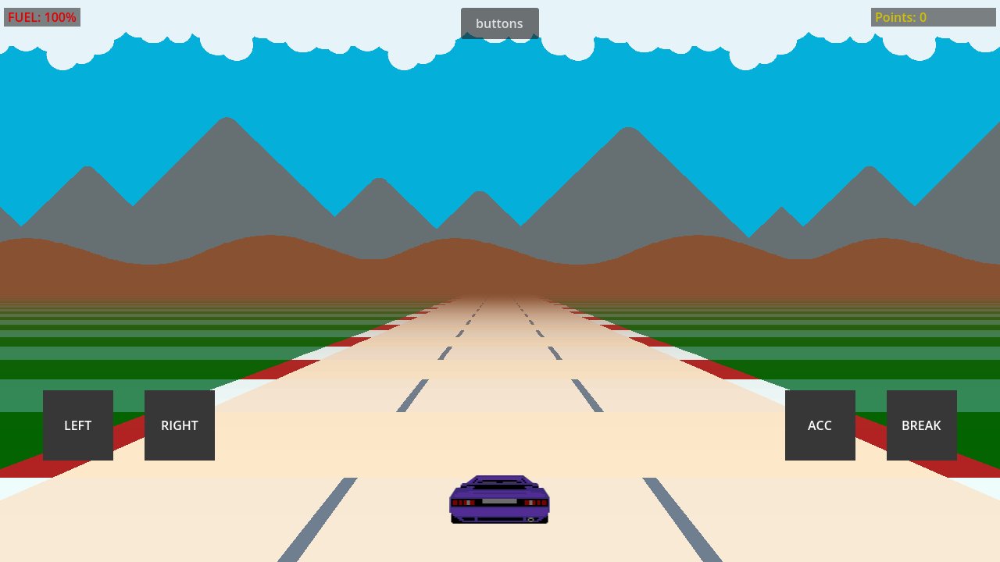
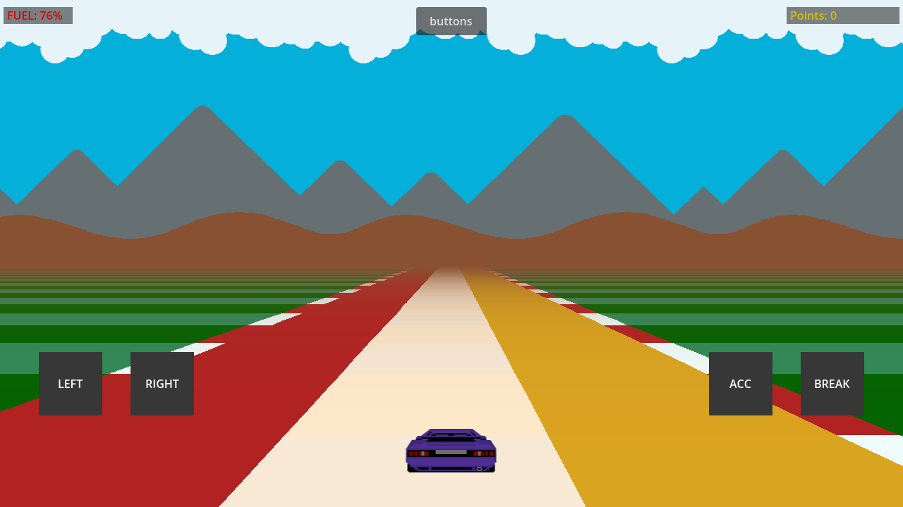
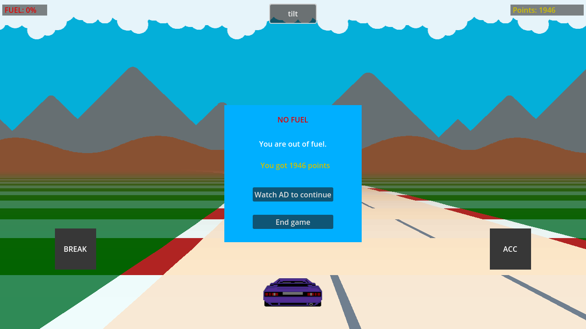

This is a repository for an old-school Outrun-style racing game, but for Android.

The goal of this project is to learn the basics of development for mobile platforms, and ultimately create a playable proof-of-concept, complete with controls typical of mobile racing games, and a basic set of test ads (assuming I can find an up-to-date plugin for Godot).

The project is being developed in the Godot engine, using the GDScript language, based on Jake Gordon's “How to build a racing game” tutorial (available here: https://jakesgordon.com/writing/javascript-racer-v1-straight/).

It uses AdMob plugin by Poing Studios, released under MIT license (for details, please visit https://github.com/poingstudios/godot-admob-plugin/blob/v3.1.2/LICENSE)

